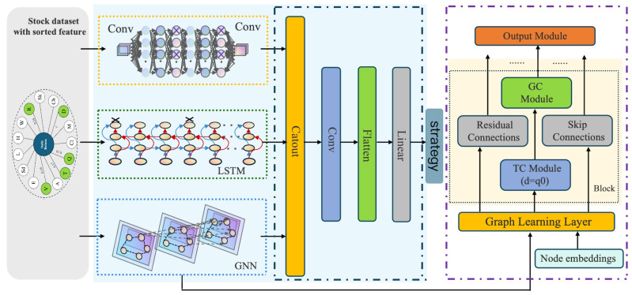
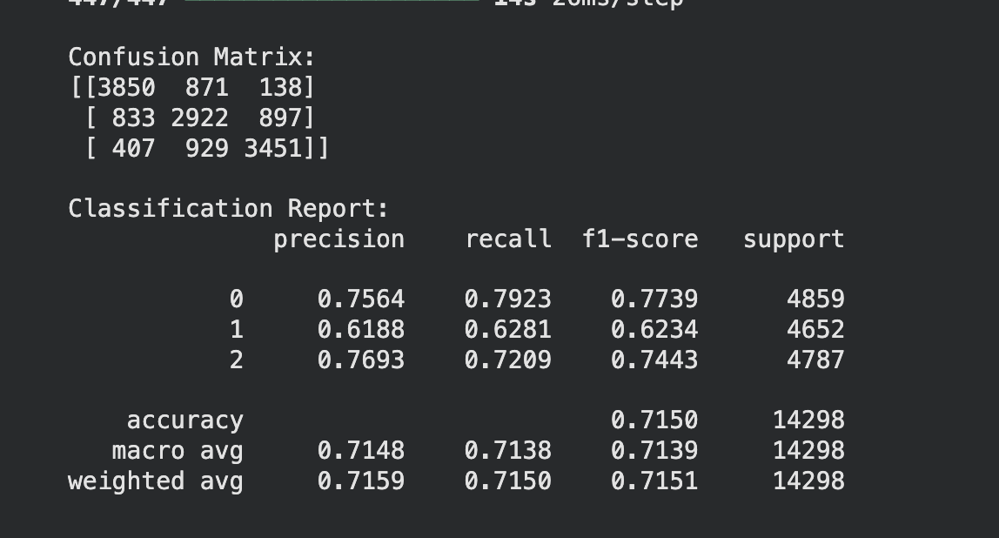
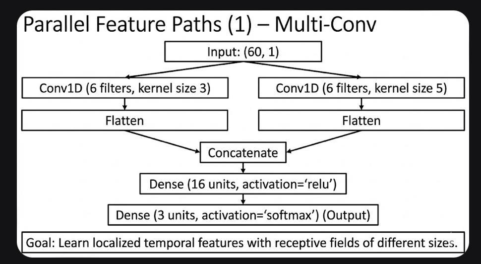
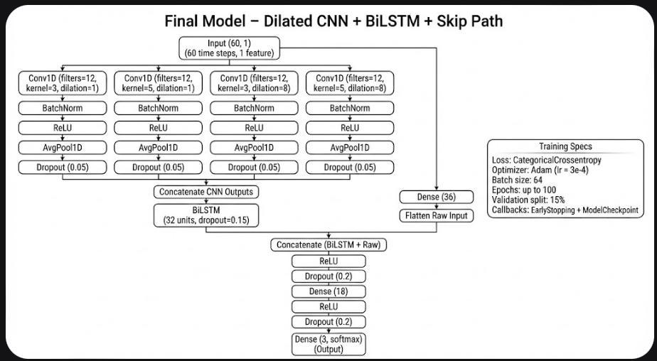
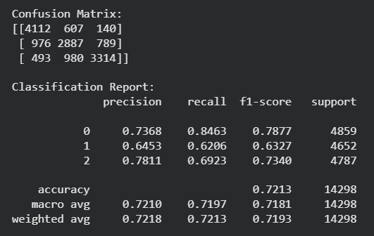

# Deep Learning for Cointegration-Based Pairs Trading

---

## 1. Understanding of the Problem

Financial markets are characterized by high levels of noise, volatility, and nonlinear interactions across assets. As a result, forecasting the absolute direction of individual stock prices remains a challenging problem. An alternative and widely studied approach is **relative-value trading**, where the objective is not to predict whether a stock will rise or fall, but rather to exploit temporary mispricings between two statistically related assets. This idea forms the basis of **pairs trading**, a market-neutral strategy first documented in academic literature by Gatev, Goetzmann, and Rouwenhorst (2006).

Pairs trading assumes that certain stocks exhibit a **long-run equilibrium relationship** driven by common economic forces, sectoral influences, or shared risk exposures. When this relationship deviates significantly from its historical norm, a **mean-reversion opportunity** may arise. The trader buys the undervalued stock and sells the overvalued one, profiting when the spread converges back to equilibrium. Unlike directional trading, this approach is largely immune to broad market movements, making it attractive to quantitative hedge funds and electronic trading desks.

A mathematically rigorous way to identify such relationships is through **cointegration**, introduced by Engle and Granger (1987). Two non-stationary price series are said to be cointegrated if a linear combination of them is stationary. This stationary spread can be modeled, standardized, and monitored for deviations, enabling systematic entry and exit rules. Classical statistical arbitrage frameworks rely on rolling regressions, z-score thresholds, and carefully engineered heuristics.

However, modern financial markets are increasingly dominated by algorithmic execution, high-frequency market microstructure, and regime shifts that cause traditional equilibrium relationships to break down. Fixed rule-based strategies may underperform in environments where co-movements evolve, spreads exhibit nonlinear dynamics, or optimal thresholds vary across market regimes. Classical pairs trading methods rely on rolling regressions, z-score thresholds (typically 2σ entry and 0.5σ exit), and handcrafted heuristics for signal rules. In contemporary markets featuring regime shifts, evolving correlations, and nonlinear spread dynamics, these fixed static thresholds may fail to adapt, leading to suboptimal performance and requiring frequent recalibration, often through grid search or optimization methods that are prone to overfitting.

This motivates moving beyond rigid threshold heuristics toward **dynamic, data-driven decision approaches**. Deep learning and machine learning models can learn richer temporal patterns and nonlinear behaviors in the spread, adapting thresholds and trade signals automatically to varying market regimes and microstructure features. This motivates the integration of machine learning and deep learning techniques into pairs trading, enabling models to learn patterns directly from historical data instead of relying on rigid hand-crafted signals.

This project builds on this line of work by **combining classical cointegration-based signal generation with data-driven learning methods**. The central problem addressed in this research is as follows:

> **Research Question**  
> *Can we transform statistically validated cointegrated stock pairs into a labeled dataset of trading actions, and then use deep learning models to predict the next-day trading decision of Buy, Hold, or Sell with improved accuracy and robustness?*

This research is rooted in established literature yet aims to extend traditional statistical arbitrage frameworks by leveraging sequence learning models capable of absorbing richer temporal structure. By bridging econometrics with modern deep learning, the study explores whether algorithmic trading decisions can be made more adaptive, consistent, and profitable in real-world markets.

---

## 2. Understanding of Solutions Proposed by Others

Recent research in deep learning for financial prediction has increasingly focused on transforming market structure, temporal dependencies, and cross-asset relationships into supervised learning tasks. Four strands of work are particularly relevant to the objective of converting cointegrated stock-pair dynamics into labeled trading decisions.

### 2.1 Hybrid CNN–LSTM–GNN for Multiclass Stock Prediction

  
   
  <em>Figure 1: High-level CLGNN hybrid CNN–LSTM–GNN architecture.</em>

  
   
  <em>Figure 2: CLGNN feature-processing and graph-learning modules.</em>

Dong and Liang (2025) introduce the **CLGNN model**, which integrates convolutional layers, LSTM temporal encoding, and graph neural networks to jointly learn price patterns, temporal dynamics, and inter-stock relationships. A carefully engineered feature set is constructed through Pearson-correlation and information-gain filtering, and the model outputs five return categories: *sharp rise, rise, flat, fall,* and *plummet*. In backtests on the CSI All-Share universe, CLGNN achieves **20.7% cumulative returns over a three-month period**, outperforming all ablation variants by **10–15%**.

The key conceptual contribution is the demonstration that **graph-based relational modeling provides meaningful predictive power when the label depends on cross-asset co-movement**, a principle highly relevant for pairs trading where the relationship between two assets is structurally important.

The authors note:

> “CNN extracts local and short-term features, LSTM is adopted to capture long-term dependencies, while GNN models the relations among stocks through graph structures.”

> “Experimental results show that the proposed hybrid model outperforms CNN, LSTM, GRU, Transformer, and TCN across all metrics.”

> “The output layer predicts five categories. The model is trained using the cross-entropy loss function to optimize multi-class classification performance.”

> “Compared with the best-performing single model, our hybrid approach improves accuracy by 7.2 percent, and improves F1-score by 5.8 percent.”

---

### 2.2 Transformer-Based Attention for Stock Movement Prediction (TEANet)

Zhang et al. (2022) propose **TEANet**, a Transformer-Encoder attention architecture based on the insight that stock markets are time-series systems with strong temporal dependence. To capture short-lived but information-rich signals, TEANet uses only a **five-day input sequence**, emphasizing that observations closer to the target day carry greater informational weight.

TEANet combines **multi-head attention** with a feature extractor that integrates **tweets and stock prices** to capture the influence of heterogeneous market signals. The Transformer component extracts deep temporal features, while attention modules highlight the most relevant time steps. Experimental results show that TEANet is significantly superior to LSTM and other baselines, with trading simulations indicating an **8–12% improvement in profitability**.

These results highlight attention’s strength in **weighting short-term temporal patterns**, an ability that maps closely to detecting brief deviations in cointegration-based spread dynamics.

---

### 2.3 Statistical Foundations for Our Pairs-Trading Setup (Zhu, 2024)

  
   
  <em>Figure 3: Conceptual pipeline for cointegration-based statistical arbitrage.</em>

Zhu (2024) reinforces the core statistical principle underlying pairs trading: certain assets share a long-run equilibrium, and their spread forms a stationary linear combination of non-stationary price series. This validates the first step of our pipeline, using **cointegration to select economically meaningful pairs and generate a stable spread to model**.

The paper also shows why classical z-score rules alone are insufficient. Zhu explains that traditional strategies are sensitive to **market regimes** and that performance deteriorates when equilibrium relationships drift. Because fixed thresholds must be recalibrated when volatility or correlation changes, classical pairs trading requires frequent tuning and remains vulnerable to nonlinear spread behavior. This motivates our approach of turning the cointegrated spread into a **labeled dataset** and letting sequence models learn adaptive buy, hold, and sell signals.

The classical benchmark in pairs trading is established by Gatev et al. (2006), who report an **annual excess return of 6.2%** and a **Sharpe ratio of 1.35** using a distance-based strategy. These results remain widely used as reference points when evaluating statistical arbitrage performance.

---

### 2.4 State-of-the-Art Deep Learning for Pairs Trading (Xia et al., 2025)

Xia et al. (2025) present one of the most advanced deep-learning frameworks for pairs trading, showing how modern architectures can replace both **pair selection** and **trade execution** in statistical arbitrage. They highlight limitations similar to those addressed in the present research: classical cointegration-based strategies struggle to capture nonlinear relationships in asset pairs and fail to adapt to evolving market dynamics.

Their solution is a **hierarchical deep learning system** that uses supervised learning with **Graph Attention Networks (GATs)** to model complex nonlinear asset relationships for pair selection, followed by a **reinforcement learning agent** that adapts trades in real time. Although their framework is more complex and relies on reinforcement learning, it aligns conceptually with our objective of replacing static z-score rules with dynamic learned signals.

Xia et al. report:

- Sharpe ratio: **1.84**  
- Annualized return: **50.98%**  
- Maximum drawdown: **17.96%**

These results significantly outperform classical approaches and demonstrate that **learning-based signals can materially outperform fixed rule-based execution**.

---

### 2.5 Synthesis and Relevance to the Present Research

Collectively, these studies show a clear progression toward the central goal of this project: transforming structural or statistical market information into **high-quality supervised labels** and applying modern deep learning architectures to predict **actionable trading decisions**.

- CLGNN reveals the value of capturing **inter-asset relationships**.  
- TEANet demonstrates the superiority of **attention-based sequence modeling**.  
- Zhu (2024) provides **robust econometric foundations** for cointegration-based spread construction.  
- Xia et al. (2025) show that pairs trading itself can be reframed as a **supervised or reinforcement learning problem**.

The present research builds on these insights by exploring whether statistically validated cointegrated stock pairs can serve as the basis for generating reliable **Buy, Hold, and Sell labels**, and whether deep learning classifiers can learn to predict these actions directly from price sequences. Prior literature strongly suggests that combining **rigorous label construction** with **expressive sequence models**, particularly attention-based and graph-based networks, can significantly enhance predictive robustness and real-world trading performance.

---

## 3. Novelty and Understanding of the Proposed Methods by the Team

The core novelty of this work lies in **unifying classical econometric techniques with modern deep learning architectures** to create an end-to-end supervised framework for predicting trading actions in statistically validated pairs.

Traditionally, cointegration has been used primarily for:

- Pair selection  
- Simple threshold-based signals

In contrast, the present approach:

- Transforms cointegrated spread dynamics into a **structured prediction task**:  
  > Using the past 60 days of spread behaviour to classify the optimal trading action (Buy, Hold, or Sell) for the following day.
- Reframes the problem from **unsupervised signal generation** to **supervised decision prediction**, representing a fundamental methodological shift.

### 3.1 Novel Dataset Construction

A central component of this paradigm is the **fully novel dataset** developed for the project. It is constructed through a rigorous multi-stage process:

1. **Rolling-window cointegration** is performed across all NIFTY 50 pairs over three-year horizons to ensure statistical validity of the underlying mean-reverting relationship.  
2. Each cointegrated window undergoes an **exhaustive grid search** over entry and exit z-score thresholds to determine the most profitable trading regime.  
3. Only windows that generate **positive realized PnL** are retained, ensuring that supervision is grounded in **economic performance** rather than heuristic assumptions.  
4. Each date within these windows is assigned a corresponding **trading state**, creating profit-aligned Buy, Hold, and Sell labels.  
5. The dataset incorporates a **deep-learning-ready representation** of the time series by constructing rolling OLS-based spreads, producing a clean temporal input sequence for each sample.

This systematic integration of econometrics, trading optimization, and supervised labeling has not appeared in prior literature, making the dataset both **unique** and **fit for purpose** in deep learning applications for statistical arbitrage.

### 3.2 Model Architecture Innovations

Building on this foundation, the proposed modelling framework evaluates multiple neural architectures, each targeting different aspects of spread behaviour:

- **Linear CNN–LSTM pipeline**  
  - Convolutional layers identify short-term local features.  
  - LSTMs capture longer-term temporal dependencies characteristic of mean-reverting processes.

- **Parallel CNN–LSTM architecture**  
  - Local feature extraction and sequence modelling operate independently before being merged into a unified representation.  
  - Leverages the **complementary strengths** of both modules.

- **Hybrid multi-branch design**  
  - Combines convolutional, recurrent, and dense pathways.  
  - Processes the spread sequence at **multiple levels of abstraction simultaneously**.

Such hybrid networks have not previously been applied to forecasting cointegrated spread dynamics, representing a further methodological advancement.

Recognizing the rapid evolution of sequence modelling techniques, the work also proposes exploring **Transformer-based architectures**, which may capture nonlinear and long-range dependencies more effectively than recurrent networks. Applying **attention mechanisms** to spread data in a pairs-trading setting is an emerging direction that further extends the novelty of the modelling effort.

### 3.3 Financially Informed Learning Objectives

The methodological innovation extends beyond architecture design and into the formulation of the **learning objective**. Instead of relying solely on standard classification loss functions, the project incorporates financially informed objectives:

- **Profit-weighted losses**  
- **Asymmetric penalties** reflecting trading risk  
- Evaluation metrics designed around **realized profit and loss**

This ensures that the models are optimized not only for **statistical accuracy** but also for **practical trading utility**, an aspect often overlooked in deep learning studies for financial prediction.

Taken together, the proposed methods present a **holistic and original contribution** to statistical arbitrage research. By combining a newly constructed, economically grounded dataset with diverse neural architectures and financially meaningful learning objectives, this work advances the state of supervised learning for cointegrated pairs trading beyond what exists in the single-stock forecasting literature.

---

## 4. Implementation of Proposed Methods

To investigate deep learning-based execution policies for cointegration-based pairs trading, we implemented and evaluated **four distinct neural architectures**. All models were trained using labeled spread sequences as input and learned to classify each timestep into one of three actions:

- **Buy** (long spread)  
- **Sell** (short spread)  
- **Hold**

The inputs were standardized **60-length spread windows**, with labels assigned using threshold-based z-score rule supervision.

---

### 4.1 Linear CONV–LSTM

This baseline model integrates temporal feature extraction via **1D convolutions** followed by sequence modeling using a **vanilla LSTM**. It processes each spread sequence of shape `(60, 1)`.

**Training setup:**

- Loss: `categorical_crossentropy`  
- Optimizer: Adam (learning rate = 0.001)  
- Epochs: 50–100 with early stopping  
- Regularization: `Dropout(0.3)`

  
   
  <em>Figure 4: Baseline linear CNN → LSTM architecture.</em>

However, we observed that **this model was overfitted**: training accuracy was high while validation accuracy stagnated and then diverged.

---

### 4.2 Parallel Multi-Conv (No Recurrence)

This is a lighter, **purely convolutional model** with no LSTM layers. The goal is to test whether **multi-scale temporal convolution alone** is sufficient.

- Multiple Conv1D layers with different kernel sizes capture patterns at varying temporal scales.  
- Global pooling layers aggregate temporal information before classification.

**Training setup:**

- Same optimization scheme as above (Adam, `categorical_crossentropy`)  
- No recurrence and lower overall model complexity

---

### 4.3 Parallel Multi-Conv + LSTM

This architecture expands temporal coverage by running **parallel convolutional paths with different kernel sizes**, followed by **LSTM layers on each path**. The parallel outputs are concatenated post-sequence modeling.

  
   
  <em>Figure 5: Parallel multi-conv + LSTM architecture.</em>

**Training setup:**

- Optimizer: Adam (learning rate = 0.001)  
- Dropout: 0.3 after LSTM  
- Batch size: 64  
- Loss: `categorical_crossentropy`

  
   
  <em>Figure 6: Confusion matrix and classification report for the parallel multi-conv + LSTM model.</em>

This model improved temporal expressiveness but at the cost of significantly increased computational complexity.

---

### 4.4 Final Model – Dilated CNN + BiLSTM + Skip Path

This is the **final deployment model**, combining **multi-scale dilated convolutions** with a **Bidirectional LSTM** and **residual skip connections** for raw input preservation. It captures both high-level features and raw temporal signatures.

  
   
  <em>Figure 7: Final dilated CNN + BiLSTM + skip-path architecture.</em>

**Architecture details:**

- **Input**: `(60, 1)`  
- **CNN branches** (each followed by BatchNorm, ReLU, AvgPool1D, Dropout = 0.05):  
  - Conv1D (filters = 12, kernel = 3, dilation = 1)  
  - Conv1D (filters = 12, kernel = 5, dilation = 1)  
  - Conv1D (filters = 12, kernel = 3, dilation = 8)  
  - Conv1D (filters = 12, kernel = 5, dilation = 8)  
- **Concatenation** of CNN outputs  
- **BiLSTM layer**: 32 units, dropout = 0.15  
- **Skip path**:  
  - Raw input → Flatten → Dense(36)  
- **Final concatenation**: BiLSTM output + skip path  
- **Dense head**:  
  - Dense(18), ReLU → Dropout(0.2)  
  - Dense(3), softmax output

**Training specs:**

- Loss: **weighted** `categorical_crossentropy`  
- Optimizer: Adam (learning rate = 3e-4)  
- Batch size: 64  
- Epochs: up to 100  
- Validation split: 15%  
- Callbacks: `EarlyStopping`, `ModelCheckpoint`

  
   
  <em>Figure 8: Training and validation loss curves for the final model.</em>

This model provided the best balance between **performance, stability, and computational cost**.

---

### 4.5 Summary of Architectural Progression

Across all models, the central innovation lies in **replacing hand-coded z-score thresholds with a learnable sequence-to-action mapping**.

Architectural evolution:

1. **Linear stacking** (4.1) – Simple CNN → LSTM pipeline  
2. **Parallel recurrent** (4.3) – Parallel CNN + LSTM paths  
3. **Purely convolutional** (4.2) – Multi-scale Conv1D only  
4. **Hybrid Dilated CNN + BiLSTM + Skip** (4.4) – Final, most balanced model

This progression reflects increasing architectural sophistication in modeling temporal volatility and reversals. The modular experimentation offers a rich **ablation path**, useful for assessing what kind of temporal structure (receptive field vs. memory vs. recurrence) most reliably identifies mean-reverting spread patterns.

---

## 5. Lessons Learned from Experimentation

The iterative experimentation process provided several key insights into how different neural architectures behave when modelling cointegrated spread sequences for trading action prediction.

### 5.1 Overfitting in the Initial Linear CNN–LSTM Model

The first architecture followed a straightforward linear pipeline: a single set of convolutional layers feeding into an LSTM layer, followed by fully connected classification layers.

- Strong training accuracy  
- Validation accuracy plateaued early and diverged → **clear overfitting**

This revealed that a simple hierarchical structure struggles to generalize the subtle mean-reversion patterns present in **sparse, noisy financial time series**. The model was learning local patterns effectively but failed to capture broader temporal structure without memorizing the training data.

---

### 5.2 Challenges with Parallel CNN–LSTM Paths

To address the limitations of the linear model, we implemented a **parallel-path architecture** where a dedicated CNN branch and an LSTM branch learned independently before merging.

- Conceptually appealing: local + long-range features learned in parallel  
- Practically: **computationally expensive** and significantly **slower to train**

This highlighted the sensitivity of spread-based models to architectural complexity and emphasized that **more parameters do not necessarily improve predictive utility**.

---

### 5.3 Experimentation with Max and Average Pooling

We tested **max-pooling**, **average-pooling**, and combinations of both:

- **Max-pooling** helped the network pick up sharper spread movements.  
- **Average-pooling** offered smoother representations of the underlying signal.

In practice, **average pooling delivered slightly better results**, producing more stable gradients and marginally improved validation performance.

---

### 5.4 From Cross-Entropy to Weighted Loss Functions

Initial models were trained using standard `categorical_crossentropy`. However, this approach:

- Treats all misclassifications equally.  
- Is misaligned with trading reality (economic asymmetry of errors).  
- Led to the model favouring the majority class (often **“Hold”**), resulting in high accuracy but poor **economic performance**.

To correct this bias, we shifted to **weighted cross-entropy**, assigning custom penalty weights through a weighting matrix:

- Encouraged more balanced learning across the three classes.  
- Forced the model to treat **economically expensive misclassifications** more seriously.

> **Key lesson:** Financial prediction demands loss functions that incorporate **economic asymmetry**, not just statistical correctness.

---

## 6. Hybrid TCN–Transformer

### 6.1 Motivation: The Hypothesis of Spectral Duality

Following guidance from our Teaching Assistant, Mr. Shreyas, to investigate neural architectures beyond the primary baseline, our team developed an experimental **Hybrid TCN–Transformer**.

The motivation stems from a fundamental characteristic of financial time series known as **Spectral Duality**. Spread data in pairs trading exhibits two distinct, often conflicting behaviours:

1. **High-Frequency Microstructure (Local)**  
   Rapid, mean-reverting shocks driven by order flow and liquidity noise (short-term memory).

2. **Low-Frequency Regime Shifts (Global)**  
   Structural changes in the cointegration relationship driven by macroeconomic factors (long-term context).

Standard architectures often struggle to capture both simultaneously:

- RNNs/LSTMs → information bottlenecks over long sequences  
- Vanilla Transformers → computationally expensive, prone to overfitting on local noise

Our hypothesis: a **parallel, dual-branch architecture** can decouple these signals, allowing specialized sub-networks to process them independently before fusion.

---

### 6.2 Model Architecture: The Dual-Stream Approach

Instead of a serial stacking of layers, we employed a **parallel design** where the multivariate input tensor is processed simultaneously by two specialized branches.

#### Branch 1: Temporal Convolutional Network (TCN)

The TCN branch acts as the **“Microscope”** for local feature extraction:

- Uses **causal dilated convolutions** with dilation factors 1, 2, 4, …  
- Expands the receptive field exponentially **without pooling**.  
- Efficiently detects sharp reversals and momentum shocks in the z-score **without losing temporal resolution**.

#### Branch 2: Transformer Encoder

The Transformer branch acts as the **“Telescope”** for global regime identification:

- Uses **Self-Attention** with sinusoidal positional encodings.  
- Attention is permutation-invariant and non-local, allowing the model to “look back” across the entire 60-day window.  
- Identifies whether the current market state structurally resembles a previous volatility regime, **regardless of time distance**.

#### Fusion & Learnable Pooling

The local (TCN) and global (Transformer) embeddings are:

1. **Concatenated**  
2. Passed through a **Learnable Attention Pooling layer**

Unlike global average pooling, which treats all time steps equally, this mechanism learns a **weight vector**, allowing the network to dynamically highlight specific time steps in the history that are most predictive of future actions.

  
   
  <em>Figure 9: Hybrid TCN–Transformer dual-stream architecture.</em>

---

### 6.3 Lessons Learned & Limitations

While the TCN–Transformer hybrid demonstrated **superior raw metrics** compared to simpler architectures, several trade-offs emerged:

1. **Computational Intensity**  
   - Dual-branch design + Self-Attention introduced ~3× increase in inference latency vs. Dilated CNN–BiLSTM.  
   - In high-frequency environments, this latency may outweigh marginal predictive gains.

2. **Data Hunger**  
   - The Transformer branch showed instability on **smaller asset pairs with less historical liquidity**.  
   - Required significantly more data to converge than CNN-based approaches.  
   - Less robust for newly listed or illiquid pairs.

3. **Complexity vs. Robustness**  
   - The “Financial Focal Loss” improved economic outcomes but was highly sensitive to hyperparameter tuning, especially the weighting of the ordinal term.  
   - The **Parallel CNN–LSTM** (Section 4.3) and **Dilated CNN–BiLSTM** (Section 4.4) were **more stable across market conditions** with fewer hyperparameters.

> **Conclusion:** Separating local and global features is theoretically correct and empirically promising for pairs trading. However, for practical deployment under the project’s constraints, the **Dilated CNN + BiLSTM (Final Model)** offers a more balanced trade-off between **computational efficiency, training stability, and predictive performance**.

---

## 7. References

- **Dong, Junhao, and Shi Liang.** 2025. *Hybrid CNN-LSTM-GNN Neural Network for A-Share Stock Prediction.*  
- **Engle, Robert F., and C. W. J. Granger.** 1987. “Co-Integration and Error Correction: Representation, Estimation, and Testing.” *Econometrica* 55(2): 251–76.  
- **Gatev, Evan, William N. Goetzmann, and K. Geert Rouwenhorst.** 2006. “Pairs Trading: Performance of a Relative Value Arbitrage Rule.” *The Review of Financial Studies* 19(3): 797–827.  
- **Xia, et al.** 2025. *State-of-the-Art Deep Learning for Pairs Trading.*  
- **Zhang, et al.** 2022. *Transformer-Based Attention for Stock Movement Prediction (TEANet).*  
- **Zhu, Xuanchi.** 2024. “Examining Pairs Trading Profitability.” *Statistical Foundations for Our Pairs-Trading Setup.* April 3, 2024.
